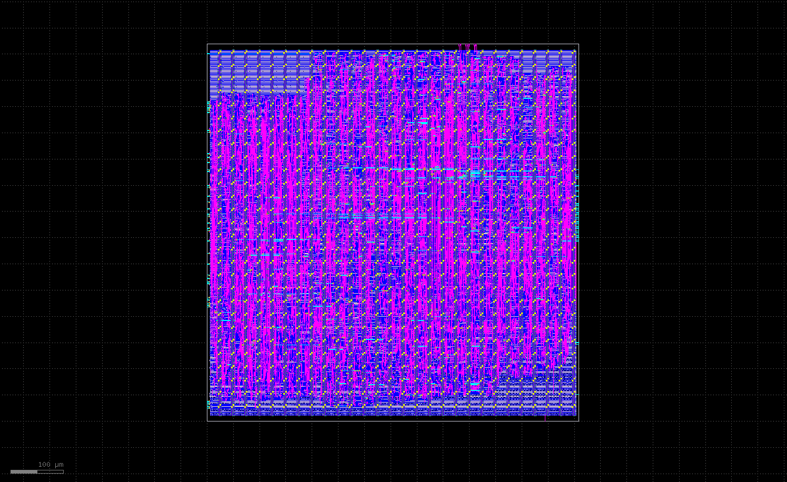

# AdiSystolic
A 4x4 output-stationary systolic array accelerator designed in SystemVerilog and physically implemented on SKY130B PDK via Openlane2



# Architecture
Design Computes a NxN matrix multiplication C=A*B using 2D grid of MAC processing elements. Data flows right across rows and weights flow down across columns.
Each PE accumulates its partal sum locally across 2N-1 feed cycles, draining to final result in 3N total cycles

Ping-Pong Buffers: While the array is computing one matrix pair, the host can load the next pair into the idle bank. On completion, controller pulses `o_swap` and banks flip (0 cycles are wasted between back-to-back multiplications)

**Controller FSM**
4 States {IDLE, CLEAR, FEED, WAIT}:
- CLEAR: pulses when accummulator resets and addresses are set to 0.
- FEED: streams 2N-1 rows to array when staggered addressing.
- WAIT: Holds until array asserts done then pulsing swap and returning to default state IDLE

A shift register inside the array delays clear pulse by r+c cycles for PE[r][c], So every PE's accumulator resets when its first valid product arrives.

## File Structure
```sh
.
├── design/         # ASIC design flow files (no bram)
└── systolic_array/
    ├── config.json
    ├── design.sdc
    ├── runs/
    └── src/
        ├── buffer.sv
        ├── controller.sv
        ├── pe.sv
        ├── systolic_array.sv
        └── top_asic.sv
├── fpga/            # FPGA constraints
├── Makefile
├── README.md   
├── rtl/            # RTL Sources (bram and buffer both present)
├── scripts/        # Script to support TB vector generation
├── tb/             # Testbenches
```

## Parameters
All parameters are computed in `top_asic.sv` and passed as literals to submodules. Avoiding `$clog2$` in port list for ASIC design.
| Parameter   | Default | Notes                                    |
| ----------- | ------- | ---------------------------------------- |
| N           | 4       | Matrix dimension. Supported: 2, 4, 8, 16 |
| DATA_WIDTH  | 8       | Input data width in bits                 |
| ACCUM_WIDTH | 32      | Accumulator width in bits                |

- When changing N, update only `localparam` block in `top_asic.sv`.

## Physical Implementation Results
Taped out SKY130B via OpenLan2/OpenROAD

**Area and cell stats**
| Metric                  | Value                          |
| ----------------------- | ------------------------------ |
| Die area                | 1.16 × 1.16 mm                 |
| Core area               | 1,311,620 µm² (0.21 mm² logic) |
| Core utilization        | 20.2%                          |
| Standard cells          | 18,213 logic cells             |
| Sequential cells        | 2,463 flip-flops               |
| Timing repair buffers   | 1,684                          |
| Antenna diodes inserted | 262                            |

**Timing - Post Route STA (9 PVT corners)**
| Corner           | Setup WS (ns) | Hold WS (ns) | Setup Violations | Hold Violations |
| ---------------- | ------------- | ------------ | ---------------- | --------------- |
| nom_tt_025C_1v80 | +12.73        | +0.46        | 0                | 0               |
| nom_ss_100C_1v60 | +7.03         | +0.55        | 0                | 0               |
| nom_ff_n40C_1v95 | +13.71        | +0.12        | 0                | 0               |
| max_ss_100C_1v60 | +6.84         | +0.50        | 0                | 0               |
| max_ff_n40C_1v95 | +13.63        | +0.13        | 0                | 0               |
| min_ss_100C_1v60 | +7.20         | +0.59        | 0                | 0               |
| min_ff_n40C_1v95 | +13.78        | +0.11        | 0                | 0               |

Worst-corner Fmax: (max_ss_100C_1v50): 1000/(20.0 - 6.84) = 76 Mhz
Nominal Fmax: (nom_tt_025C_1v80): 1000/(20.0 - 12.73) = 137 Mhz


## **How To Run Simulation**
Requires Python 3, Verilator or Xsim (Vivado), and Make.
```bash
# Generate test vectors and run simulation (N=4, 10 random test cases)
make clean
make TB=tb_top N=4 NUM=10

# Run with different matrix size
make clean
make TB=tb_top N=8 NUM=20
```

## **How To Run the Physical Flow**
Requires OpenLane 2 in a nix-shell environment with SKY130B PDK installed via volare.
``` bash
cd design/
openlane systolic_array/config.json
```
Results land in systolic_array/runs/RUN_<timestamp>/final/:


**View the GDS**
```bash
klayout final/gds/top_asic.gds \
  -l $PDK_ROOT/sky130A/libs.tech/klayout/tech/sky130A.lyp
```

